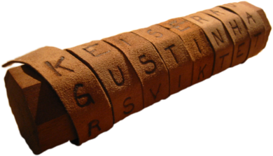

# La Scytale

## Présentation
La Scytale, également connue sous le nom de bâton de Plutarque, était un dispositif de cryptographie utilisé par les Spartiates vers 404 av. JC. Elle constitue l'une des premières méthodes de cryptographie militaire documentée.

  

## Principe et histoire
La Scytale fonctionnait en enroulant une fine bande de cuir ou de parchemin autour d'un bâton de diamètre spécifique. Le message était alors écrit en plaçant une lettre sur chaque tour de la bande. Pour déchiffrer le message, le destinataire devait posséder un bâton de diamètre identique et enrouler la bande autour de celui-ci pour lire le message décodé.

## Déchiffrement
La résistance de ce type de chiffrement est relativement faible, car il repose sur une simple transposition des lettres du message plutôt que sur une substitution. Par conséquent, il peut être cassé assez facilement.

Pour déchiffrer un message Scytale, on peut suivre ces étapes :

    1. Compter le nombre de lettres sur la bande.
    2. Créer des grilles de différentes tailles pour placer toutes les lettres.
    3. Remplir les cases des grilles ligne par ligne avec le texte chiffré, puis colonne par colonne avec une copie de la grille.
    4. Vérifier si un texte en clair apparaît en lisant perpendiculairement au remplissage de la grille.

Par exemple, si le message chiffré est "MSETSEUEARR_SISG_EMQN".

En utilisant une grille 3x7 :
|   |   |   |
|:--|:-:|--:|
| M | S | E |
| T | S | E |
| U | E | A |
| R | R | _ |
| S | I | S |
| G | _ | E |
| M | Q | N |

On ne distingue aucun message. Donc on recommence avec une grille 7x3 :
|   |   |   |   |   |   |   |
|:--|:-:|:-:|:-:|:-:|:-:|--:|
| M | S | E | T | S | E | U |
| E | A | R | R | _ | S | I |
| S | G | _ | E | M | Q | N |

 On peut déchiffrer le message en lisant colonne par colonne : "MESSAGER_TRES_MESQUIN".

## Sources
+ Wikipédia : https://fr.wikipedia.org/wiki/Scytale
+ https://www.iparcours.fr/ouvrages/medias/Complements/correctionPDF/Cahier52019/corpdfcahier52019a1p124.pdf